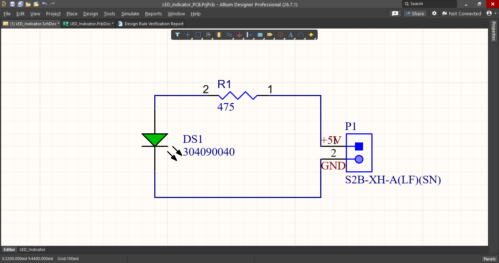
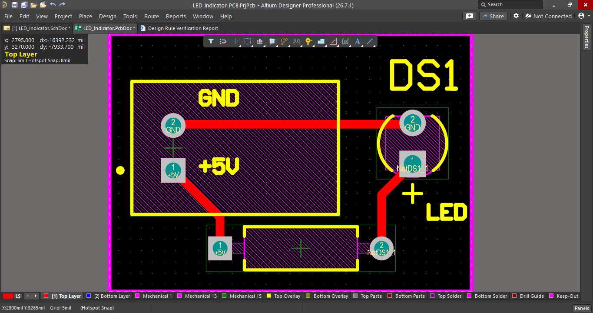
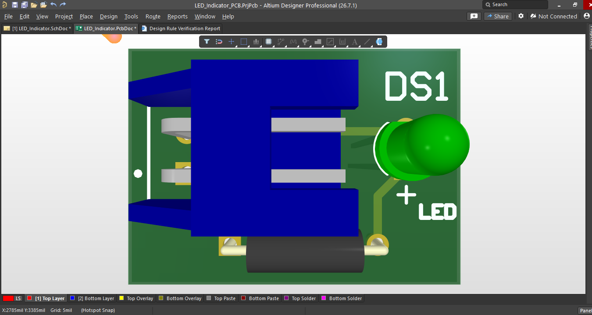

# LED Indicator PCB Design

## Project Overview
This project is a simple LED Indicator PCB designed using **Altium Designer**. It demonstrates the complete PCB design workflow, including schematic capture, PCB layout, design rule checking (DRC), and output file generation.

---

## Software Used
- Altium Designer

---

## Components Used
- LED
- 475 Ω Resistor
- 2-Pin Connector

---

## Circuit Description
The circuit is powered through a 2-pin connector. A 475 Ω resistor limits the current flowing through the LED, allowing it to operate safely as a power indicator.

---

## Project Files
- `LED_Indicator.SchDoc` – Schematic Design
- `LED_Indicator.PcbDoc` – PCB Layout
- `LED_Indicator_PCB.PrjPcb` – Altium Project File
- `gerber` – Gerber, Drill, and Manufacturing Files

---

## Features
- Schematic Design
- PCB Layout
- Design Rule Check (DRC)
- Gerber File Generation
- Ready for PCB Fabrication

---

## Images
Add the following screenshots:
- Schematic
- PCB 2D Layout
- PCB 3D View

---

## Learning Outcome
Through this project, I learned:
- Creating schematics in Altium Designer
- Component placement
- PCB routing
- Running DRC
- Generating Gerber files for manufacturing

---

## Images

### Schematic

### PCB Layout

### 3D View

